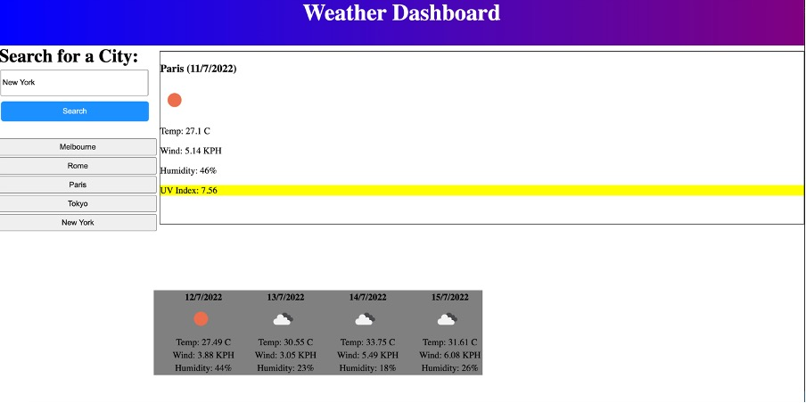

WEATHER APP

Week 6 Challenge: Weather App

Live link: https://ogray96.github.io/WeatherApp/

The challenge for this week was to create a weather application. By using fetch requests we needed to be able to display the current date and weather and a few other key weather details. Furthermore each search was to be saved in local storage so a button would be created making it easy  to search that location again.

